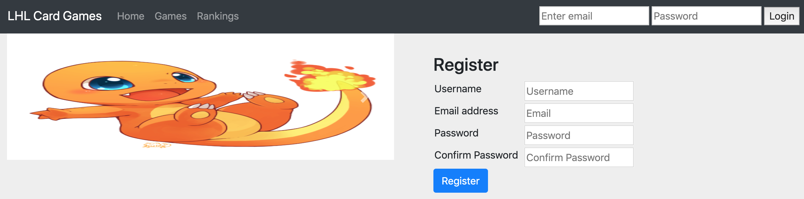
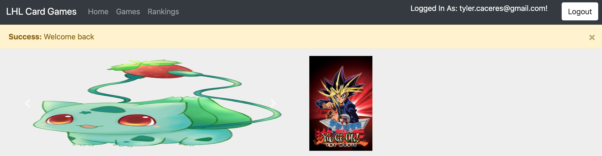
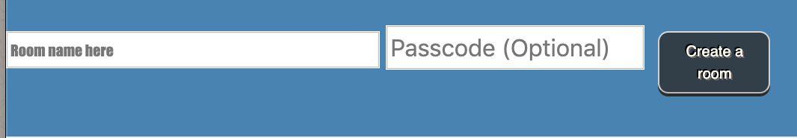
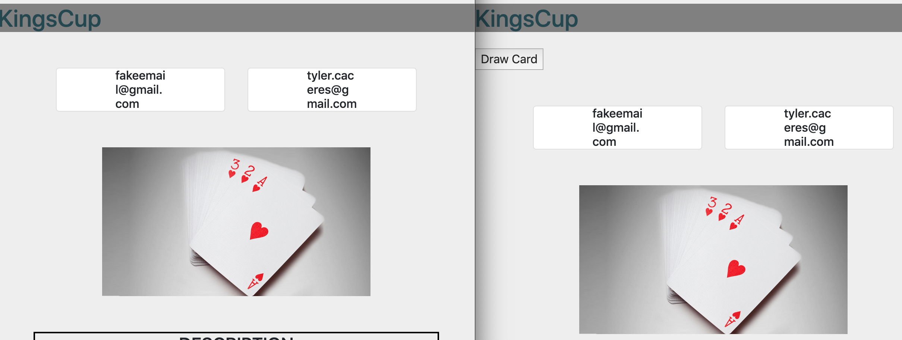
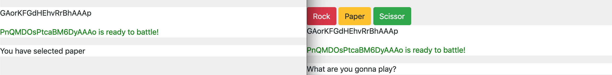

# Speed Comparison of API requests

This

# Tech Stack

### Front End

- Bootstrap
- EJS
- Socket.IO

### Back End

- Express
- JQuery
- Socket.IO

## Final Product

`home page`

`logged in`

`create_room`

`kings cup - initial state`

`results from previous games`

`waiting for turn -rock paper scissors`

