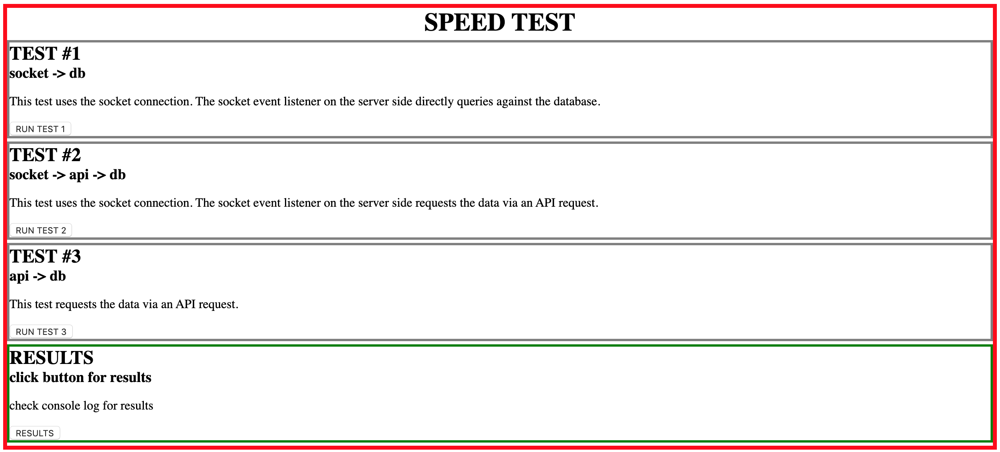
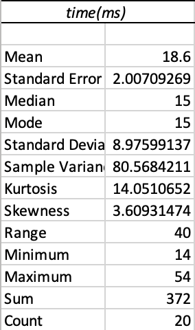
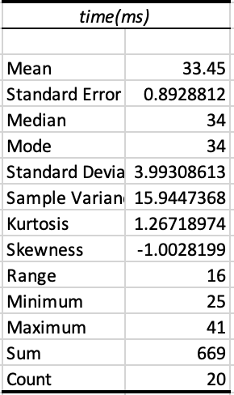
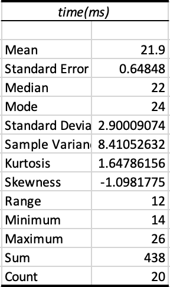

# Speed Comparison of API requests

This repository shows a comparison of 3 different ways to get data from the server.

- sockets
  - using socket.io to query the database directly
- sockets / api
  - using socket.io and then requesting the data through an axios get request
- api
  - requesting the data through an AJAX get request

# Tech Stack

### Front End

- HTML5
- CSS3
- Socket.IO
- JQuery

### Back End

- Express
- Node.js
- axios
- PostgreSQL
- Socket.IO

# Instructions

1. create postgresql database named 'speedtest'
2. create .env file in the root directory that includes the following information (Note: change the information to match your own)

```
DB_HOST=localhost
DB_USER=yourusername
DB_PASS=yourpassword
DB_NAME=speedtest
DB_PORT=5432
```

3. run `npm install` to get the required packages.
4. run `npm run db:reset` to create the table (users) for the database, and create the seeded data
5. run `npm start` to start up the server.

## Final Product

`home page - tests and results`

```
clicking on each test button will run one instance of the API request (click as many times as you want results for each test scenario)
```

```
clicking on the result button shows the list of the results in the browser's console
```



`test 1 results: socket -> db`



`test 2 results: socket -> api -> db`



`test 3 results: api -> db`


